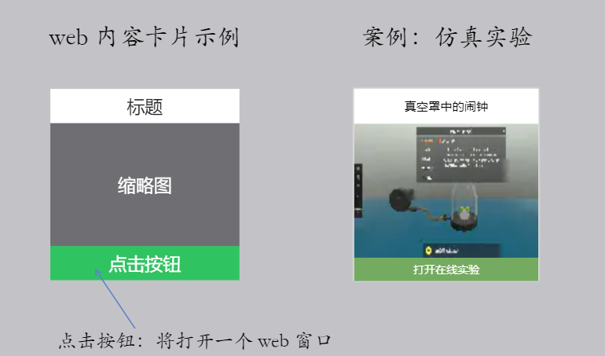

# web 内容卡片元素

示例：
[《Web内容卡片元素》](https://r302.cc/4z6Vvlp?platform=enpc&channel=copylink)



## API

::: warning 警告
如果你的业务需要同时支持 EN5 Windows 客户端和 enow，请使用 easinote-proxy npm 包。
:::

npm 包(推荐，同时支持 EN5 Windows 客户端和 enow)  

详见：[easinote-proxy](/apis/npm/easinote-proxy.html)

```js
EasiNoteProxy.Proxy.insertElementByJson('WebPresentationCard2','{元素数据描述的 Json 对象}');
```

EN window 客户端(不推荐，仅支持 Windows 客户端)

这种方式仅限于 EN5 Windows 客户端，ENOW（web网页）端不支持。

```js
window.external.InsertElementByJson("WebPresentationCard2", "{元素数据描述的 Json 对象}")
```

> `WebPresentationCard` 的兼容性存在一些问题，而且不支持鉴权处理，请使用 `WebPresentationCard2`

## 属性说明

| 属性协议名          | 类型    | 必需 | 描述                          | 默认       | 备注                                               |
|---------------------|---------|-----|-----------------------------|------------|----------------------------------------------------|
| tag                 | String  | 是   | 卡片的类型标记                |            | 业务标记，区分不同元素，类似 seewo-tiku seewo-huaban |
| title               | String  | 是   | 卡片上的标题                  |            |                                                    |
| thumbnailUrl        | String  | 是   | 卡片中的缩列图                |            |                                                    |
| buttonContent       | String  | 是   | 卡片下方的点击按钮的标题      | 打开       |                                                    |
| editingUrl          | String  | 是   | 备课端内容的URL               |            |                                                    |
| displayUrl          | String  | 是   | 授课端内容的URL               |            |                                                    |
| editingFrameSize    | Size    | 是   | 备课下打开的 web 页面的大小   |            |                                                    |
| displayFrameSize    | Size    | 否   | 授课下打开的 web 页面的大小   |            | displayMode 为 Window 是必须指定                   |
| layoutSize          | Size    | 是   | 元素初始大小                  |            | 宽度最小值：100 高度最小值：100；参考值：(200,200)     |
| layoutRatio         | Double  | 否   | 初始大小之上的缩放比例        | 1          | 等比缩放元素大小                                   |
| displayMode         | 枚举    | 否   | 授课下窗口的呈现方式          | FullScreen | FullScreen: 全屏；Window: 窗口显示                  |
| closeButtonPosition | String  | 否   | 授课全屏时，关闭按钮位置       | null       | 值形式：left,top,right,bottom; 详见下方说明         |
| appResourceId       | String  | 否   | 希沃资源中心对应的 ResourceId |            | 需要鉴权时必须指定                                 |
| auth                | Boolean | 否   | 是否在打开是需要鉴权          | false      | 默认为 false，需要鉴权时指定为 true                 |

授课下，点击按钮打开的窗口，默认为全屏显示。
全屏显示时，因为是 web 内容，为了避免加载失败等边界情况，以及让用户可以方便退出。
希沃白板会在界面上常驻一个关闭按钮。为了避免交互冲突，可以通过 closeButtonPosition 自定义关闭按钮的位置。  

top 值必须是 0，left 和 right 要小于 200，bottom 要小于 500；left 和 right 不能同时有值。  
举例："50,0,0,100" 距离左边50px，下方100px；"0,0,80,70" 距离右边80px，下方70px；
注意：closeButtonPosition 需要 5.2.2.3000 以上版本才支持。

### 关于鉴权的说明

如果插件在希沃资源中心上架，通过希沃对用户进行分发，并且插件中所提供的资源是付费的，而且希望在用户是否此资源时进行权限校验。  
则需要在插入此元素时，设置 appResourceId 和 auth，用户在使用此资源，打开 URL 时，希沃白板会通过 API 提供当前用户的权限信息。

> 此功能详情请参考 [5.1 Web 前端鉴权 API](http://open.seewo.com/#/service/1847/doc/2256)

## json 示例

```json
{
  "tag": "seewo-tiku-test",
  "title": "希沃题库（测试）",
  "thumbnailUrl": "http://n.sinaimg.cn/sinakd20200605ac/416/w640h576/20200605/301b-iurnkpq9297963.jpg",
  "buttonContent": "点击",
  "editingUrl": "https://bilibili.com",
  "displayUrl": "https://www.zhihu.com/",
  "editingFrameSize": {
    "width": 1000,
    "height": 500
  },
  "layoutSize": {
    "width": 200,
    "height": 200
  },
  "appResourceId": "appidappidappid",
  "auth": true,
}
```
