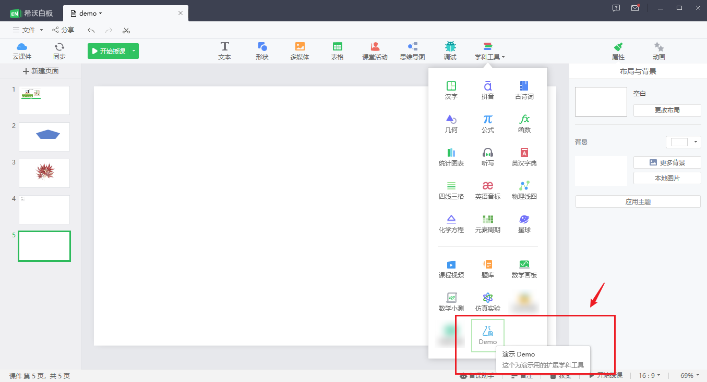
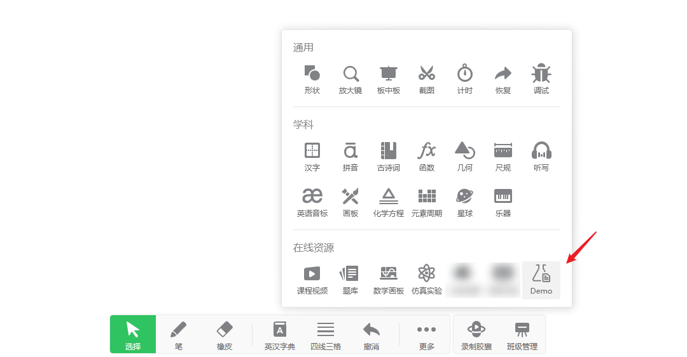
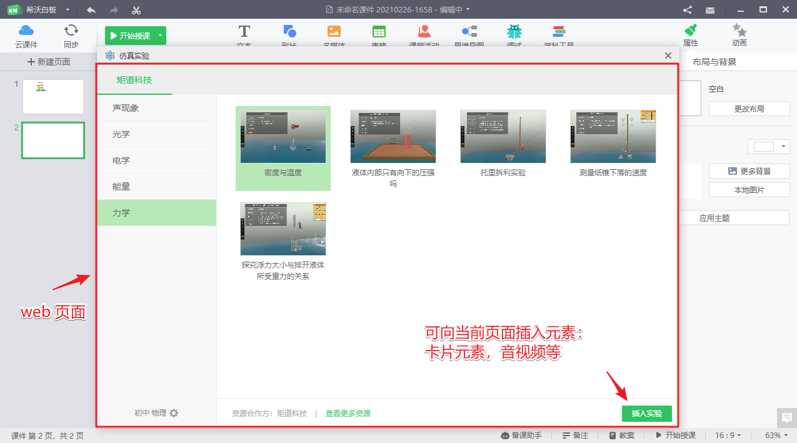

# 快速开始

1 下载安装 [希沃白板客户端](https://easinote.seewo.com/)
2 下载安装 [demo 演示学科工具插件](https://github.com/EasiNote/EasiNote.ClientWebApi.Documentation/files/7249803/EasiNote.Plugin.WebTools.Demo.exe.zip)

> demo 演示学科工具插件，下载之后是一个 ZIP 包，需要先解压再运行。

重启启动 EN 客户端，打开任一课件，在备授课学科工具中，就可以找到新增的工具入口。

* 备课学科工具示意

* 授课学科工具示意

* 备课下 web 页显示示例，授课下类似

## 如何配置一个定制的学科工具

以上是演示用的学科工具扩展，自定义相关的参数，需要使用调试用配置工具，详见：[学科工具插件调试配置工具](./03DebugTool.md)。

具体的参数含义，详见：[学科工具插件配置](./02Configurations.md)
