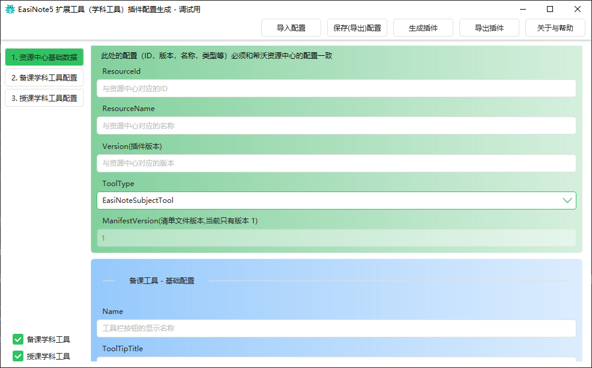

# 学科工具插件调试配置工具

下载工具

[三方资源接入工具包](https://drive.cvte.com/p/DdFjqXMQ-JsCGLvAEQ )

> 下载的为 ZIP 包，需要先解压。工具无需安装，直接运行即可

相关的配置详情见 [学科工具插件配置](./02Configurations.md)

## 相关功能说明

* 导入导出配置

在编辑一系列的配置之后，导出配置为 json 文件，以保存这些设置。
导入配置就是加载 json 文件。

* 生成插件

配置编辑完成之后，点击 `生成插件` 可以直接在本地安装相应配置参数的学科工具插件。
重启 EN5 客户端，即可对新增的学科工具效果和交互进行验证和调试。

* 导出插件

在调试完成之后，导出插件 enx 文件，交给希沃工作人员进行上架操作。

> 希沃开放平台的开发者中心还在建设中，目前上架等部分操作需要手动进行。

