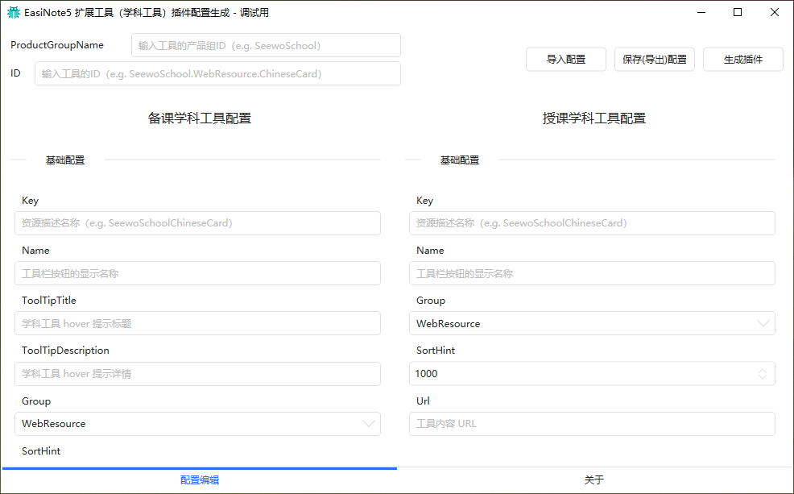

# 学科工具插件调试配置工具

下载工具

[EasiNote.Plugin.WebTools.DebugTool](https://github.com/EasiNote/EasiNote.ClientWebApi.Documentation/files/7250121/EasiNote.Plugin.WebTools.DebugTool.exe.zip)

> 下载的为 ZIP 包，需要先解压。工具无需安装，直接运行即可

相关的配置详情见 [学科工具插件配置](./02Configurations.md)

## 相关功能说明

* 导入导出配置

在编辑一系列的配置之后，导出配置为 json 文件，以保存这些设置。
导入配置就是加载 json 文件。

* 生成插件

配置编辑完成之后，点击 `生成插件` 可以直接生成响应配置参数的学科工具插件，重启 EN5 客户端，即可对新增的学科工具效果和交互进行验证和调试。

::: warning 警告
这里生成的插件会标记为调试使用，在后期确定相关配置之后，可以将导出的配置 json 文件交由希沃白板开发人员生成可分发给用户的插件。  
分发给用户的插件配置，需要由经过希沃白板团队审核。
:::
