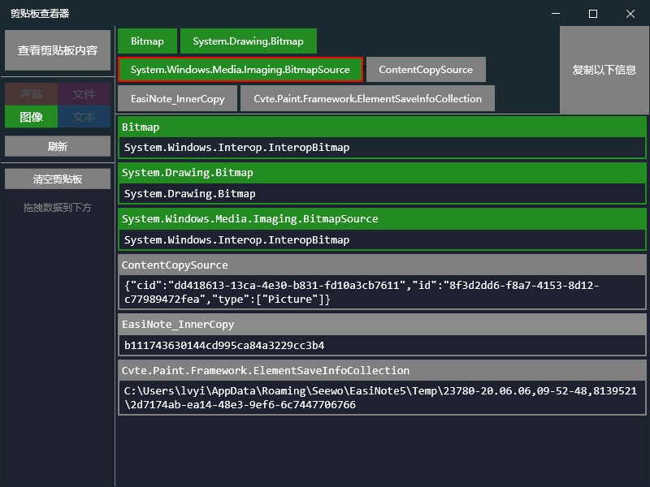

# 插入元素

## 方法原型

```csharp
void InsertElement(string elementSaveInfoCollection);
```

注意：此 API 例外，不遵循公共的 JSON 参数和回调返回。即：

1. 不能用 `WebToolParamModel` 来包装参数，参数是裸的字符串
2. 无法获取到方法的执行结果

### 参数

```csharp
string elementSaveInfoCollection
```

这是一个 XML 字符串。是唯一确定一个元素的存储对象。

一个例子如下：

```xml
<ElementCollection>
  <Elements>
    <Picture>
      <Source>app://data:image/svg+xml;base64,PD94bWwgdmVyc2lvbj0iMS4wIiBzdGFuZGFsb25lPSJubyI/PjwhRE9DVFlQRSBzdmcgUFVCTElDICItLy9XM0MvL0RURCBTVkcgMS4xLy9FTiIgImh0dHA6Ly93d3cudzMub3JnL0dyYXBoaWNzL1NWRy8xLjEvRFREL3N2ZzExLmR0ZCI+PHN2ZyB0PSIxNTc1MjUzMzI4NjMyIiBjbGFzcz0iaWNvbiIgdmlld0JveD0iMCAwIDE5NzcgMTAyNCIgdmVyc2lvbj0iMS4xIiB4bWxucz0iaHR0cDovL3d3dy53My5vcmcvMjAwMC9zdmciIHAtaWQ9IjE2MDMiIHhtbG5zOnhsaW5rPSJodHRwOi8vd3d3LnczLm9yZy8xOTk5L3hsaW5rIiB3aWR0aD0iNDYuMzM1OTM3NSIgaGVpZ2h0PSIyNCI+PGRlZnM+PHN0eWxlIHR5cGU9InRleHQvY3NzIj48L3N0eWxlPjwvZGVmcz48cGF0aCBkPSJNMzA0LjU5MDY5IDU3NS4yODA4OTloMTEyNy4zNDUxMDV2MzE1LjY4NTM5M0gzMDQuNTkwNjl6IiBmaWxsPSIjOTJDQUVFIiBwLWlkPSIxNjA0Ij48L3BhdGg+PHBhdGggZD0iTTE5NTYuNDY4NyA0MDMuNzIzOTE3Yy0xOTguMjY2NDUzLTI3LjAxNzY1Ny0zOTUuMzAwMTYxIDU0LjQ0NjIyOC01NjYuMDM1MzEzIDE5MC4wNDgxNTQtMjQ4LjgwODk4OSAxOTcuNjUwMDgtNTU0LjczNTE1MiAyNDQuMjg4OTI1LTgzMi4xMDI3MjkgMTM3LjE0Mjg1N0MzMTEuMjY4MDU4IDYzNS41ODI2NjUgMTI1Ljg0MjY5NyA0MjQuMjY5NjYzIDIxLjE2MjExOSAxNTQuODEyMTk5VjU2MC44OTg4NzZhOTcwLjQ3ODMzMSA5NzAuNDc4MzMxIDAgMCAwIDY1NC44OTU2NjYgMzYxLjcwNzg2NmMyODEuMzczOTk3IDMwLjgxODYyIDU1Ni4yNzYwODMtNTEuMzY0MzY2IDc0Ni4xMTg3OC0yMzMuMDkxNDkzIDE0MC45NDM4Mi0xMzQuNTc0NjM5IDMyNC4wMDY0MjEtMjI5LjE4NzgwMSA1MzQuMTg5NDA2LTIyOS4xODc4MDF6IiBmaWxsPSIjNjZDMDg5IiBwLWlkPSIxNjA1Ij48L3BhdGg+PHBhdGggZD0iTTk0My4xNTI0ODggNDA3LjUyNDg4YTUzLjkzMjU4NCA1My45MzI1ODQgMCAxIDEtNTMuOTMyNTg0LTUzLjkzMjU4NSA1My45MzI1ODQgNTMuOTMyNTg0IDAgMCAxIDUzLjkzMjU4NCA1My45MzI1ODV6IiBmaWxsPSIjRjNEMjRGIiBwLWlkPSIxNjA2Ij48L3BhdGg+PHBhdGggZD0iTTkyMi4yOTg1NTUgNDA3LjUyNDg4Yy0yLjI2MDAzMiA0Mi40MjY5NjYtNjYuMTU3MzAzIDQyLjczNTE1Mi02Ni4xNTczMDMgMHM2My44OTcyNzEtNDIuNDI2OTY2IDY2LjE1NzMwMyAwYzEuNDM4MjAyIDI2LjYwNjc0MiA0My4xNDYwNjcgMjYuODEyMTk5IDQxLjcwNzg2NiAwYTc0Ljc4NjUxNyA3NC43ODY1MTcgMCAxIDAtNzcuNzY1NjUxIDc0LjU4MTA1OSA3Ni4xMjE5OSA3Ni4xMjE5OSAwIDAgMCA3Ny43NjU2NTEtNzQuNTgxMDU5YzEuNDM4MjAyLTI2LjgxMjE5OS00MC4yNjk2NjMtMjYuNzA5NDctNDEuNzA3ODY2IDB6IiBmaWxsPSIjNDk0OTRBIiBwLWlkPSIxNjA3Ij48L3BhdGg+PHBhdGggZD0iTTY4Ni44NDQzMDIgMTc3LjYxNzk3OHMtMzUxLjQzNDk5MiAxLjAyNzI4Ny00MjAuMDU3Nzg1IDBhNTAuODUwNzIyIDUwLjg1MDcyMiAwIDAgMSAzLjY5ODIzNC0xMDEuNDk1OTg4aDE2Ny4yNDIzNzZhNTEuMzY0MzY2IDUxLjM2NDM2NiAwIDAgMSA1MS4zNjQzNjYtNTAuODUwNzIyaDYyLjU2MTc5OGE1MS4zNjQzNjYgNTEuMzY0MzY2IDAgMCAxIDUwLjg1MDcyMiA1MS4zNjQzNjZoODQuMzQwMjg5YTUwLjg1MDcyMiA1MC44NTA3MjIgMCAwIDEgMCAxMDEuNTk4NzE2eiIgZmlsbD0iI0VDRUJFQiIgcC1pZD0iMTYwOCI+PC9wYXRoPjxwYXRoIGQ9Ik02ODYuODQ0MzAyIDE1Ni44NjY3NzRjLTE0MC4wMTkyNjIgMC0yODAuMTQxMjUyIDEuNjQzNjYtNDIwLjA1Nzc4NSAwbDIwLjU0NTc0NiAyMC41NDU3NDZhMjAuNTQ1NzQ2IDIwLjU0NTc0NiAwIDAgMC0xNS4zMDY1ODEtMjAuNTQ1NzQ2cS01NC4yNDA3Ny01Mi4wODM0NjctMS4xMzAwMTYtNjAuNTA3MjIzaDQuMTA5MTQ5YzUuMTM2NDM3LTAuODIxODMgMTAuNzg2NTE3IDAgMTYuMDI1NjgzIDAgMTkuMDA0ODE1LTEuMzM1NDc0IDM4LjYyNjAwMyAwIDU3LjczMzU0NyAwaDg4LjY1NDg5NmEyMS4xNjIxMTkgMjEuMTYyMTE5IDAgMCAwIDIwLjU0NTc0Ni0xNS4zMDY1ODFjNi45ODU1NTQtNTEuOTgwNzM4IDExNy4xMTA3NTQtNTEuMzY0MzY2IDEyMy45OTM1NzkgMGEyMC41NDU3NDYgMjAuNTQ1NzQ2IDAgMCAwIDIwLjU0NTc0NyAxNS4zMDY1ODFoNTIuMDgzNDY3YTE0Mi44OTU2NjYgMTQyLjg5NTY2NiAwIDAgMSAyNy4zMjU4NDMgMGMzMi45NzU5MjMgNi43ODAwOTYgMzguNDIwNTQ2IDU1LjU3NjI0NCAwIDYwLjcxMjY4LTI2LjUwNDAxMyAzLjU5NTUwNi0xNS4yMDM4NTIgNDMuNjU5NzExIDExLjA5NDcwMyA0MC4xNjY5MzQgNjAuMDk2MzA4LTguMTE1NTcgOTAuMDkzMDk4LTgyLjc5OTM1OCA0MS4wOTE0OTItMTI0LjgxNTQwOS0zMy4yODQxMDktMjguMzUzMTMtOTAuODEyMTk5LTE3Ljc3MjA3MS0xMzEuMjg3MzE5LTE3Ljc3MjA3MWwyMC41NDU3NDYgMTUuMzA2NTgxYy0xMi42MzU2MzQtOTMuOTk2NzktMTkxLjY5MTgxNC05My45OTY3OS0yMDQuMzI3NDQ3IDBsMjAuMDMyMTAyLTE1LjMwNjU4MWMtNTQuOTU5ODcyIDAtMTExLjc2ODg2LTQuNDE3MzM1LTE2Ni41MjMyNzQgMC04Ni43MDMwNSA3LjA4ODI4My05Ni4xNTQwOTMgMTI1LjAyMDg2Ny0xMC4yNzI4NzMgMTQyLjM4MjAyM2wtMTUuMzA2NTgxLTIwLjAzMjEwM2EyMC41NDU3NDYgMjAuNTQ1NzQ2IDAgMCAwIDIwLjU0NTc0NiAyMC41NDU3NDdjMTM5LjkxNjUzMyAxLjc0NjM4OCAyODAuMDM4NTIzIDAgNDIwLjA1Nzc4NSAwIDI2LjA5MzA5OCAwLjkyNDU1OSAyNi4wOTMwOTgtNDAuNzgzMzA3LTAuNzE5MTAxLTQwLjY4MDU3OHpNMjk1LjQ0NzgzMyAyNjEuODU1NTM4aDEzNy43NTkyM2MyNi44MTIxOTkgMCAyNi44MTIxOTktNDEuNzA3ODY1IDAtNDEuNzA3ODY1SDI5NS40NDc4MzNjLTI2LjgxMjE5OSAwLTI2LjgxMjE5OSA0MS43MDc4NjUgMCA0MS43MDc4NjV6TTQ4MS40ODk1NjcgMjYxLjg1NTUzOGMyNi44MTIxOTkgMCAyNi44MTIxOTktNDEuNzA3ODY1IDAtNDEuNzA3ODY1cy0yNi45MTQ5MjggNDEuNzA3ODY1IDAgNDEuNzA3ODY1ek0yMzQuOTQwNjEgMjYxLjg1NTUzOGMyNi44MTIxOTkgMCAyNi45MTQ5MjgtNDEuNzA3ODY1IDAtNDEuNzA3ODY1cy0yNi44MTIxOTkgNDEuNzA3ODY1IDAgNDEuNzA3ODY1eiIgZmlsbD0iIzQ5NDk0QSIgcC1pZD0iMTYwOSI+PC9wYXRoPjxwYXRoIGQ9Ik0xNDIyLjE3NjU2NSA1NzUuMjgwODk5QzEyMzIuMzMzODY4IDc1Ni41OTcxMTEgOTU3LjQzMTc4MiA4MzkuNDk5MTk3IDY3Ni4wNTc3ODUgODA4LjI2OTY2M0E5NzAuNzg2NTE3IDk3MC43ODY1MTcgMCAwIDEgMjEuMTYyMTE5IDQ0Ni42NjQ1MjZ2NTU2LjE3MzM1NUgxOTU2LjU3MTQyOVYzNDUuOTkwMzY5Yy0yMTAuMzg4NDQzIDAtMzkzLjQ1MTA0MyA5NC42MTMxNjItNTM0LjM5NDg2NCAyMjkuMjkwNTN6IiBmaWxsPSIjOTNDOEE1IiBwLWlkPSIxNjEwIj48L3BhdGg+PHBhdGggZD0iTTEyNDIuMDkzMDk4IDY4MS42MDUxMzZjLTE2NC4zNjU5NzEgODguOTYzMDgyLTM1OC43Mjg3MzIgMTMxLjgwMDk2My01NDQuNDYyMjc5IDEwNy45Njc4OTgtMjYuNjA2NzQyLTMuMzkwMDQ4LTI2LjI5ODU1NSAzOC4zMTc4MTcgMCA0MS43MDc4NjUgMTkyLjUxMzY0NCAyNC42NTQ4OTYgMzk1LjQwMjg4OS0yMS41NzMwMzQgNTY1LjAwODAyNS0xMTMuNzIwNzA2IDIzLjUyNDg4LTEyLjczODM2MyAyLjU2ODIxOC00OC43OTYxNDgtMjEuMDU5MzktMzUuOTU1MDU3ek0xMzg1LjE5NDIyMiA2MjkuMjEzNDgzYzI2LjgxMjE5OSAwIDI2LjkxNDkyOC00MS43MDc4NjUgMC00MS43MDc4NjVzLTI2LjgxMjE5OSA0MS43MDc4NjUgMCA0MS43MDc4NjV6IiBmaWxsPSIjNDk0OTRBIiBwLWlkPSIxNjExIj48L3BhdGg+PHBhdGggZD0iTTE0ODkuMzYxMTU2IDQ5MC41Mjk2OTVhMTA2My4yNDIzNzYgMTA2My4yNDIzNzYgMCAwIDAtODIuMTgyOTg2IDY5Ljk1ODI2NmMtMTkuNDE1NzMgMTguNDkxMTcyIDEwLjI3Mjg3MyA0Ny45NzQzMTggMjkuNDgzMTQ2IDI5LjQ4MzE0N2E5MzcuNjA1MTM2IDkzNy42MDUxMzYgMCAwIDEgNzQuMDY3NDE2LTYzLjM4MzYyOCAyMS41NzMwMzQgMjEuNTczMDM0IDAgMCAwIDcuMzk2NDY5LTI4LjU1ODU4OCAyMC41NDU3NDYgMjAuNTQ1NzQ2IDAgMCAwLTI4LjQ1NTg1OS03LjQ5OTE5N3oiIGZpbGw9IiM0OTQ5NEEiIHAtaWQ9IjE2MTIiPjwvcGF0aD48cGF0aCBkPSJNMC42MTYzNzIgNzY3LjA3NTQ0MXYyMzYuMjc2MDg0YTIxLjE2MjExOSAyMS4xNjIxMTkgMCAwIDAgMjAuNTQ1NzQ3IDIwLjU0NTc0NmgxOTM0Ljk5ODM5NWEyMS4xNjIxMTkgMjEuMTYyMTE5IDAgMCAwIDIwLjU0NTc0Ni0yMC41NDU3NDZWMzQ1Ljk5MDM2OWEyMS4xNjIxMTkgMjEuMTYyMTE5IDAgMCAwLTIwLjU0NTc0Ni0yMC41NDU3NDYgNzIyLjE4Mjk4NiA3MjIuMTgyOTg2IDAgMCAwLTM0NS45OTAzNyA4Ny42Mjc2MDhjLTIzLjUyNDg4IDEyLjg0MTA5MS0yLjU2ODIxOCA0OC43OTYxNDggMjAuNTQ1NzQ3IDM1Ljk1NTA1NmE2NzUuNTQ0MTQxIDY3NS41NDQxNDEgMCAwIDEgMzI0LjkzMDk3OS04Mi4xODI5ODVsLTIwLjU0NTc0Ni0yMC41NDU3NDd2NjU2LjUzOTMyNmwyMC41NDU3NDYtMjAuNTQ1NzQ2cS04MTYuNDg3OTYxIDAuNzE5MTAxLTE2MzIuODczMTk0IDBIMjEuMTYyMTE5bDIwLjU0NTc0NiAyMC41NDU3NDZ2LTIzNi4yNzYwODNjMC0yNi44MTIxOTktNDEuNzA3ODY1LTI2LjkxNDkyOC00MS43MDc4NjUgMHoiIGZpbGw9IiM0OTQ5NEEiIHAtaWQ9IjE2MTMiPjwvcGF0aD48cGF0aCBkPSJNMTcwMi44MzE0NjEgMzU0LjgyNTA0YzI2LjgxMjE5OSAwIDI2LjgxMjE5OS00MS43MDc4NjUgMC00MS43MDc4NjVzLTI2LjkxNDkyOCA0MS43MDc4NjUgMCA0MS43MDc4NjV6TTE5NTYuNDY4NyAyNjUuNTUzNzcyYTc2Ni41NjE3OTggNzY2LjU2MTc5OCAwIDAgMC0yMDguMDI1NjgyIDMwLjgxODYyYy0yNS42ODIxODMgNy4zOTY0NjktMTQuNzkyOTM3IDQ3LjY2NjEzMiAxMC45OTE5NzQgNDAuMTY2OTM0YTcyNy4yMTY2OTMgNzI3LjIxNjY5MyAwIDAgMSAxOTcuMDMzNzA4LTI5LjM4MDQxN2MyNi44MTIxOTkgMCAyNi44MTIxOTktNDEuOTEzMzIzIDAtNDEuMDkxNDkzek00ODkuMDkxNDkzIDc0Ny4wNDMzMzlBMTAwMy41NTY5ODIgMTAwMy41NTY5ODIgMCAwIDEgMjE2LjM0NjcwOSA2MDYuMDk5NTE4Yy0yMS43Nzg0OTEtMTUuODIwMjI1LTQyLjUyOTY5NSAyMC41NDU3NDYtMjAuNTQ1NzQ2IDM1Ljk1NTA1N2ExMDM2LjEyMTk5IDEwMzYuMTIxOTkgMCAwIDAgMjgyLjE5NTgyNyAxNDUuMTU1Njk4YzI1LjU3OTQ1NCA4LjQyMzc1NiAzNi40Njg3LTMxLjc0MzE3OCAxMS4wOTQ3MDMtNDAuMTY2OTM0eiIgZmlsbD0iIzQ5NDk0QSIgcC1pZD0iMTYxNCI+PC9wYXRoPjxwYXRoIGQ9Ik0xNjU1LjY3ODk3MyAzNTMuNDg5NTY3aC0yMDIuNTgxMDZsMTAxLjI5MDUzLTMxNi43MTI2ODEgMTAxLjI5MDUzIDMxNi43MTI2ODF6IiBmaWxsPSIjOTNDOEE1IiBwLWlkPSIxNjE1Ij48L3BhdGg+PHBhdGggZD0iTTE2MDAuNzE5MTAxIDI0Mi4zMzcwNzlMMTYzNS41NDQxNDEgMzU5LjU1MDU2MmwyMC41NDU3NDctMjYuNDAxMjg0aC0yMDIuOTkxOTc1bDIwLjU0NTc0NyAyNi40MDEyODQgMTAwLjc3Njg4Ni0zMTcuMjI2MzI0aC00MC4xNjY5MzRsNDEuMDkxNDkyIDEyMy45OTM1NzljOC40MjM3NTYgMjUuMzczOTk3IDQ4LjY5MzQxOSAxNC40ODQ3NTEgNDAuMjY5NjYzLTEwLjk5MTk3NEwxNTc0LjQyMDU0NiAzMC44MTg2MmEyMC41NDU3NDYgMjAuNTQ1NzQ2IDAgMCAwLTQwLjE2NjkzNCAwbC0xMDEuMjkwNTMgMzE2LjcxMjY4YTIwLjU0NTc0NiAyMC41NDU3NDYgMCAwIDAgMjAuNTQ1NzQ2IDI2LjQwMTI4NGgyMDIuNTgxMDZhMjAuNTQ1NzQ2IDIwLjU0NTc0NiAwIDAgMCAyMC4wMzIxMDItMjYuNDAxMjg0bC0zNC44MjUwNC0xMTYuNjk5ODM5Yy03LjYwMTkyNi0yNS42ODIxODMtNDcuODcxNTg5LTE0LjY5MDIwOS00MC4xNjY5MzQgMTEuMDk0NzAzeiIgZmlsbD0iIzQ5NDk0QSIgcC1pZD0iMTYxNiI+PC9wYXRoPjxwYXRoIGQ9Ik0xNTMzLjUzNDUxIDM1OC4xMTIzNnYxNjQuMzY1OTcxYzAgMjYuODEyMTk5IDQxLjYwNTEzNiAyNi45MTQ5MjggNDEuNjA1MTM3IDB2LTE2NC4zNjU5NzFjMC0yNi44MTIxOTktNDEuNjA1MTM2LTI2LjkxNDkyOC00MS42MDUxMzcgMHoiIGZpbGw9IiM0OTQ5NEEiIHAtaWQ9IjE2MTciPjwvcGF0aD48cGF0aCBkPSJNMTQzMS45MzU3OTUgNDk5Ljk4MDczOGgtMjI1LjE4MTM4MWwxMTIuNTkwNjktMzUyLjA1MTM2NCAxMTIuNTkwNjkxIDM1Mi4wNTEzNjR6IiBmaWxsPSIjOTNDOEE1IiBwLWlkPSIxNjE4Ij48L3BhdGg+PHBhdGggZD0iTTEzNzMuMTc0OTYgMzc1Ljc4MTcwMWwzOC43Mjg3MzIgMTI5Ljc0NjM4OSAyMC41NDU3NDYtMjYuNDAxMjg0aC0yMjUuNjk1MDI0bDIwLjU0NTc0NyAyNi40MDEyODQgMTEzLjAwMTYwNS0zNTIuMDUxMzY0aC00MC4xNjY5MzVsNDUuODE3MDE1IDEzNy44NjE5NThjOC40MjM3NTYgMjUuMjcxMjY4IDQ4LjY5MzQxOSAxNC40ODQ3NTEgNDAuMTY2OTM0LTExLjA5NDcwM2wtNDUuODE3MDE0LTEzNy44NjE5NTlhMjAuNTQ1NzQ2IDIwLjU0NTc0NiAwIDAgMC00MC4xNjY5MzUgMGwtMTEzLjAwMTYwNSAzNTIuMDUxMzY1YTIwLjU0NTc0NiAyMC41NDU3NDYgMCAwIDAgMjAuNTQ1NzQ3IDI2LjQwMTI4NGgyMjUuMTgxMzhhMjAuNTQ1NzQ2IDIwLjU0NTc0NiAwIDAgMCAyMC41NDU3NDctMjYuNDAxMjg0bC00MC4wNjQyMDYtMTI5Ljc0NjM4OWMtNy42MDE5MjYtMjUuNjgyMTgzLTQ3Ljg3MTU4OS0xNC42OTAyMDktNDAuMTY2OTM0IDExLjA5NDcwM3oiIGZpbGw9IiM0OTQ5NEEiIHAtaWQ9IjE2MTkiPjwvcGF0aD48cGF0aCBkPSJNMTI5OC40OTExNzIgNTA1LjAxNDQ0NlY2OTkuNTgyNjY1YzAgMjYuODEyMTk5IDQxLjcwNzg2NSAyNi44MTIxOTkgNDEuNzA3ODY1IDBWNTA1LjAxNDQ0NmMwLTI2LjgxMjE5OS00MS43MDc4NjUtMjYuODEyMTk5LTQxLjcwNzg2NSAwek0xMzYuNjI5MjEzIDM0MS4wNTkzOUExMjcxLjU3NjI0NCAxMjcxLjU3NjI0NCAwIDAgMSA0MS43MDc4NjUgMTQ5LjI2NDg0OGMtOC4xMTU1Ny0yMC41NDU3NDYtNDEuMDkxNDkzLTE5LjYyMTE4OC00MS4wOTE0OTMgNS41NDczNTF2NTQwLjk2OTUwMmMwIDI2LjgxMjE5OSA0MS43MDc4NjUgMjYuODEyMTk5IDQxLjcwNzg2NiAwVjE1NC44MTIxOTlsLTQxLjA5MTQ5MyA1LjU0NzM1MmExMzU2LjAxOTI2MiAxMzU2LjAxOTI2MiAwIDAgMCA5OS4zMzg2ODQgMjAxLjc1OTIyOWMxMy44NjgzNzkgMjIuOTA4NTA3IDQ5LjkyNjE2NCAxLjk1MTg0NiAzNi4wNTc3ODQtMjAuNTQ1NzQ2ek01NjMuODc4MDEgNzEwLjc4MDA5NmMtMTUwLjgwNTc3OC01OS44OTA4NTEtMjc3LjM2NzU3Ni0xNjIuOTI3NzY5LTM3NC41NDg5NTctMjkxLjg1MjMyNy0xNS45MjI5NTMtMjEuMDU5MzktNTIuMTg2MTk2IDAtMzUuOTU1MDU2IDIwLjU0NTc0NiAxMDQuNzgzMzA3IDEzOC40NzgzMzEgMjM3LjQwNjEgMjQ2LjU0ODk1NyAzOTkuNDA5MzEgMzExLjA2MjYwMSAyNC45NjMwODIgMTAuMjcyODczIDM1Ljc0OTU5OS0zMC44MTg2MiAxMS4wOTQ3MDMtNDAuMjY5NjYzek02NDIuODc2NDA0IDc3OS40MDI4ODljMjYuODEyMTk5IDAgMjYuODEyMTk5LTQxLjcwNzg2NSAwLTQxLjcwNzg2NXMtMjYuOTE0OTI4IDQxLjcwNzg2NSAwIDQxLjcwNzg2NXoiIGZpbGw9IiM0OTQ5NEEiIHAtaWQ9IjE2MjAiPjwvcGF0aD48cGF0aCBkPSJNMzE2LjYwOTk1MiA1OTUuODI2NjQ1aDQ1Ny4xNDI4NTdjMjYuODEyMTk5IDAgMjYuOTE0OTI4LTQxLjYwNTEzNiAwLTQxLjYwNTEzNmgtNDU3LjE0Mjg1N2MtMjYuODEyMTk5IDAtMjYuOTE0OTI4IDQxLjYwNTEzNiAwIDQxLjYwNTEzNnpNODQyLjk5MTk3NCA1OTUuODI2NjQ1aDc5LjEwMTEyNGMyNi44MTIxOTkgMCAyNi44MTIxOTktNDEuNjA1MTM2IDAtNDEuNjA1MTM2SDg0Mi45OTE5NzRDODE1Ljc2ODg2IDU1NC43MzUxNTIgODE1Ljc2ODg2IDU5NS44MjY2NDUgODQyLjk5MTk3NCA1OTUuODI2NjQ1ek0xMDQ2LjcwMzA1IDU5NS44MjY2NDVoMjEyLjQ0MzAxN2MyNi44MTIxOTkgMCAyNi44MTIxOTktNDEuNjA1MTM2IDAtNDEuNjA1MTM2aC0yMTIuNDQzMDE3Yy0yNi44MTIxOTkgMC0yNi45MTQ5MjggNDEuNjA1MTM2IDAgNDEuNjA1MTM2ek05NzUuMjAzODUyIDU5NS44MjY2NDVjMjYuODEyMTk5IDAgMjYuODEyMTk5LTQxLjYwNTEzNiAwLTQxLjYwNTEzNnMtMjYuODEyMTk5IDQxLjYwNTEzNiAwIDQxLjYwNTEzNnoiIGZpbGw9IiM0OTQ5NEEiIHAtaWQ9IjE2MjEiPjwvcGF0aD48cGF0aCBkPSJNMTUxMi41Nzc4NDkgMTAwMi45NDA2MXYtMS41NDA5MzFhMTQzLjgyMDIyNSAxNDMuODIwMjI1IDAgMSAwLTI4Ny42NDA0NDkgMHYxLjU0MDkzMXpNMTczNC4yNjY0NTMgMTAwMi45NDA2MXYtMC44MjE4M2E3NC42ODM3ODggNzQuNjgzNzg4IDAgMSAwLTE0OS4yNjQ4NDggMHYwLjgyMTgzeiIgZmlsbD0iI0JCQkNCRSIgcC1pZD0iMTYyMiI+PC9wYXRoPjxwYXRoIGQ9Ik0xMjIzLjA4ODI4MyA5MjUuNjg4NjA0YTE3NC42Mzg4NDQgMTc0LjYzODg0NCAwIDAgMC0xOC4zODg0NDQgNzcuMjUyMDA2IDIxLjI2NDg0OCAyMS4yNjQ4NDggMCAwIDAgMjAuNTQ1NzQ3IDIwLjU0NTc0NmgyODcuNjQwNDQ5YTIxLjI2NDg0OCAyMS4yNjQ4NDggMCAwIDAgMjAuNTQ1NzQ3LTIwLjU0NTc0NmM2Ljk4NTU1NC0xMzMuNTQ3MzUyLTE0NS40NjM4ODQtMjAwLjAxMjg0MS0yNTEuMzc3MjA3LTE0MS4zNTQ3MzUtMjMuNDIyMTUxIDEyLjk0MzgyLTIuNDY1NDkgNDguODk4ODc2IDIxLjA1OTM5IDM1Ljk1NTA1NiA3OS43MTc0OTYtNDQuMTczMzU1IDE5My45NTE4NDYgNC40MTczMzUgMTg4LjYwOTk1MiAxMDUuMzk5Njc5bDIwLjU0NTc0Ni0yMC41NDU3NDZoLTI4Ny42NDA0NWwyMC41NDU3NDcgMjAuNTQ1NzQ2YTEzMi4xMDkxNDkgMTMyLjEwOTE0OSAwIDAgMSAxMi42MzU2MzQtNTYuMTkyNjE2YzEwLjI3Mjg3My0yNC4zNDY3MDktMjUuMTY4NTM5LTQ1LjYxMTU1Ny0zNS45NTUwNTYtMjAuNTQ1NzQ3ek0xNzU1LjEyMDM4NSAxMDAyLjk0MDYxYzIuMTU3MzAzLTUyLjE4NjE5Ni00NC40ODE1NDEtOTYuMjU2ODIyLTk1LjQzNDk5Mi05Ni4yNTY4MjJzLTk3LjQ4OTU2NyA0NC4wNzA2MjYtOTUuMzMyMjYzIDk2LjI1NjgyMmEyMS4wNTkzOSAyMS4wNTkzOSAwIDAgMCAyMC41NDU3NDYgMjAuNTQ1NzQ2aDE0OS4xNjIxMTljMjYuODEyMTk5IDAgMjYuOTE0OTI4LTQxLjYwNTEzNiAwLTQxLjYwNTEzNmgtMTQ4Ljk1NjY2MWwyMC41NDU3NDYgMjAuNTQ1NzQ2Yy0yLjg3NjQwNC03MC4zNjkxODEgMTEwLjMzMDY1OC03MC4yNjY0NTMgMTA3LjU1Njk4MyAwLTAuODIxODMgMjcuMzI1ODQzIDQwLjg4NjAzNSAyNy4yMjMxMTQgNDEuOTEzMzIyIDAuNTEzNjQ0ek0xNjIuMTA1OTM5IDYxMS4xMzMyMjZjMjYuODEyMTk5IDAgMjYuOTE0OTI4LTQxLjcwNzg2NSAwLTQxLjcwNzg2NXMtMjYuODEyMTk5IDQxLjcwNzg2NSAwIDQxLjcwNzg2NXoiIGZpbGw9IiM0OTQ5NEEiIHAtaWQ9IjE2MjMiPjwvcGF0aD48L3N2Zz4=</Source>
      <PictureName>test-svg24.svg</PictureName>
      <Alpha>1</Alpha>
      <Bright>0</Bright>
      <Contrast>0</Contrast>
      <Saturation>0</Saturation>
      <DisplayRegion>
        <Rectangle>0,0,200,200</Rectangle>
      </DisplayRegion>
      <Style>
        <StyleType>None</StyleType>
        <PicturePresetStyle>None</PicturePresetStyle>
      </Style>
      <MetaData>
        <PictureSize>200,200</PictureSize>
        <FileSize>8532</FileSize>
      </MetaData>
      <Id>146a4a61-872f-4be1-97d3-1cc75c54b862</Id>
      <X>540</X>
      <Y>260</Y>
      <Width>200</Width>
      <Height>200</Height>
      <Rotation>0</Rotation>
      <IsLocked>False</IsLocked>
      <CanClone>False</CanClone>
      <HasMask>False</HasMask>
      <IsErasable>False</IsErasable>
      <IsErased>False</IsErased>
      <RotateOrigin>0.5,0.5</RotateOrigin>
    </Picture>
  </Elements>
</ElementCollection>
```

其中，除 `Source` 支持资源类型外，其他与希沃白板 enbx 的存储格式完全相同。

**注意：** 凡元素存储数据中涉及到资源的，都必须以 `id://` 开头，随后紧跟 Data URL 作为实际数据。

## 如何得知元素/元素集的 XML 存储数据

1. 在希沃白板中制作一个元素；
2. 选中并复制此元素；
3. 查看剪贴板，得知复制所得的存储数据文件路径；
4. 去对应的文件路径中查看元素的存储数据。



## 调用示例

`InsertElement` 方法可以给插件带来完全创建可交互式课件内容的能力。

```js
window.external.InvokeMethod(
  `{
    "method":"InsertElement",
    "args":
    "<ElementCollection>\n <Elements>\n <Picture>\n <Source>app://data:image/svg+xml;base64,PD94b......z4=</Source>\n <PictureName>test-svg24.svg</PictureName>\n <Alpha>1</Alpha>\n <Bright>0</Bright>\n <Contrast>0</Contrast>\n <Saturation>0</Saturation>\n <DisplayRegion>\n <Rectangle>0,0,200,200</Rectangle>\n </DisplayRegion>\n <Style>\n <StyleType>None</StyleType>\n <PicturePresetStyle>None</PicturePresetStyle>\n </Style>\n <MetaData>\n <PictureSize>200,200</PictureSize>\n <FileSize>8532</FileSize>\n </MetaData>\n <Id>146a4a61-872f-4be1-97d3-1cc75c54b862</Id>\n <X>540</X>\n <Y>260</Y>\n <Width>200</Width>\n <Height>200</Height>\n <Rotation>0</Rotation>\n <IsLocked>False</IsLocked>\n <CanClone>False</CanClone>\n <HasMask>False</HasMask>\n <IsErasable>False</IsErasable>\n <IsErased>False</IsErased>\n <RotateOrigin>0.5,0.5</RotateOrigin>\n </Picture>\n </Elements>\n</ElementCollection>"
    }`)
```
