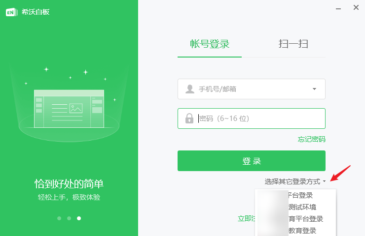
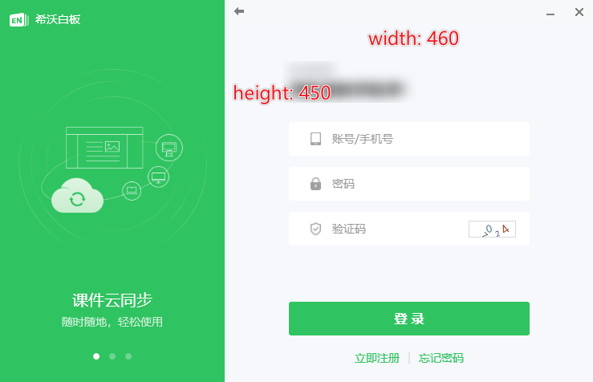
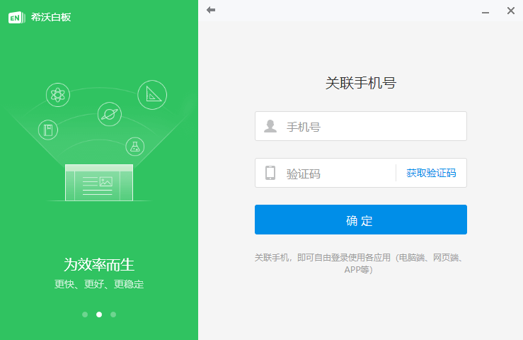

三方需要向希沃提供 Oauth2 接口，让希沃可以获取用户信息，以完成用户绑定与登录。

通用文档：  
[三方学校对接希沃标准流程文档](https://shimo.im/docs/pdXYdw3pHXPr6XYw/read )

以上是通用的文档（除了接入希沃的 EN5 业务，也可以接入其它业务），以下就 EN5 Windows 客户端的接入，做补充详细说明。

## 登录入口

在安装相关的登录插件（由希沃提供或调试工具生成）之后，重启 EN5，可以在登录界面看到相关的登录入口。

点击入口，会以 web 形式呈现三方的登录页面（URL由三方提供），此 web 窗口的大小是 460*450，要求 web 页面需要针对此大小做布局优化。

用户在此页面，使用三方账号登录 EN5。

## 技术流程

为了方便说明，以下文档的中三方，使用 MAXHUB 作为举例。

### 1 登录 URL

上面提到，三方需要提供登录 URL，此 URL 可以是标准的 Oauth URL，也可以是定制化的 URL。

标准 Oauth URL 举例：

`http://maxhub.com/oauth/authorize?app_id=d35909a4e270&redirect_uri=https://id.seewo.com/cas/adapter/maxhub/seewo/easinote-login&response_type=code&state=1`

其中 redirect_uri 是用户登录成功之后，三方回调希沃的地址，并在回调此 redirect_uri 时，附带 Code 参数。
此 redirect_uri 由希沃提供。

这种方式对三方来说，是比较通用的。

另一种 URL 形式，是三方为希沃提供定制的 URL，举例：

`http://maxhub.com/oauth/authorize/seewo?redirect_uri=https://id.seewo.com/cas/adapter/maxhub/seewo/easinote-login`

将参数隐藏，放在后台中处理。一般没有必要使用这种方式。

> PS 这里之所以不将 redirect_uri 也一起隐藏到定制数据中，是因为，这个回调 URL 只是对于希沃白板5这个业务场景有效，其它的希沃业务场景，如 web 端的唤起等，需要另外的回调地址。

具体使用哪种 URL 形式，由第三方自行决定。

### 2 用户登录与帐号绑定

在用户使用三方账号登录成功之后，web 页面应当被重定向到提供的 redirect_uri，并通过 query 参数附带 Code 数据。
希沃将通过此 Code 数据，最终获取到三方的用户信息。

情况1：如果此三方用户没有绑定希沃账号（首次登录），则 web 页面会重定向到账号绑定页面，要求用户绑定手机号。

如果此手机号已经是希沃账号，则会直接绑定，如果此手机号不是希沃账号，则会创建一个新的希沃账号。

完成绑定之后，登录窗口会自动关闭，登入到云课件列表界面。

情况2：如果此三方用户已经绑定了希沃帐号，则登录窗口会直接关闭，登入到云课件列表界面。

## 注意事项

1. 登录窗口的大小为 460*450，是一个比较小的窗口，UI 显示上需要做适配。
2. 此处的登录 URL，不应使用浏览器缓存保存登录状态，否则下次进入将直接登录，无法输入账号登录。

## 附录

相关文档备忘链接（无需关注）

[三方学校对接希沃标准流程文档](https://shimo.im/docs/pdXYdw3pHXPr6XYw/read )  
[三方登录接入希沃白板 Windows 客户端](https://shimo.im/docs/WlArzGKRQQi98lA2 )
