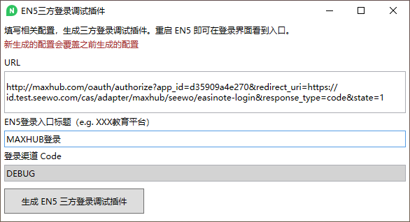

如何调试登录流程？

## 浏览器调试

在开发联调和测试阶段，通常希沃提供的是测试环境回调地址，如 `https://id.test.seewo.com/cas/adapter/maxhub/seewo/easinote-login`。

完整的 URL 可能是：
`http://maxhub.com/oauth/authorize?app_id=d35909a4e270&redirect_uri=https://id.test.seewo.com/cas/adapter/maxhub/seewo/easinote-login&response_type=code&state=1`

在浏览器中打开上述地址，登录账号。在 EN5 Windows 客户端场景下，如果最终浏览器 URL 被重定向到了 `https://easinote.seewo.com/webTokenLoginCallback`（或者其测试环境地址），并且能够在 Cookies 中找到 x-auth 的值，则说明登录成功。

## EN5 Windows 客户端调试

下载安装调试插件：[https://drive.cvte.com/p/DdFjqXMQ-JsCGLvAEQ](https://drive.cvte.com/p/DdFjqXMQ-JsCGLvAEQ) 

填写 URL 和入口标题，生成登录插件。重启 EN5 Windows 客户端，即可在登录窗口看到登录入口。

注意：由于 EN5 的测试环境地址没有对外网开放，此处仅适合回调地址是类似 `https://id.seewo.com/cas/adapter/maxhub/seewo/easinote-login` 这样正式环境的 redirect_uri 才有效。
