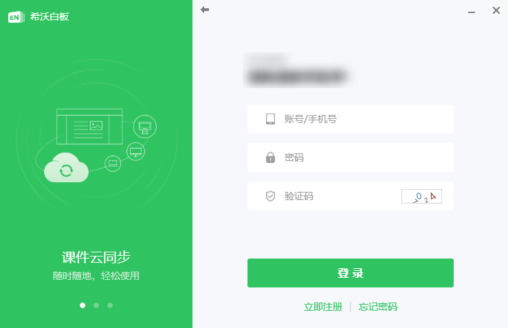

## 账号登录

实现的功能：用户可以使用第三方账号，登录使用 EN5。

## 效果示意

这是一个嵌入到 EN5 客户端登录界面的 WebView，以插件形式进行接入。

用户可以使用第三方账号进行登录，如果是首次登录，将会跳转到账号绑定页面，绑定一个希沃账号。

## 具体文档

[SEEWO · 希沃开放平台 · 三方授权登录介绍](http://open.seewo.com/#/service/1112/doc/1695 )

## 说明

支持三方登录，需要双方的账号系统进行开发联调，详见上方的希沃开放平台文档。具体细节需要进行更多线下的沟通。

在双方账号系统联调通过之后，EN5 客户端可以提供一个登录插件（一个独立的 exe 程序），用户使用此插件向 EN5 注入三方登录入口和登录支持。
