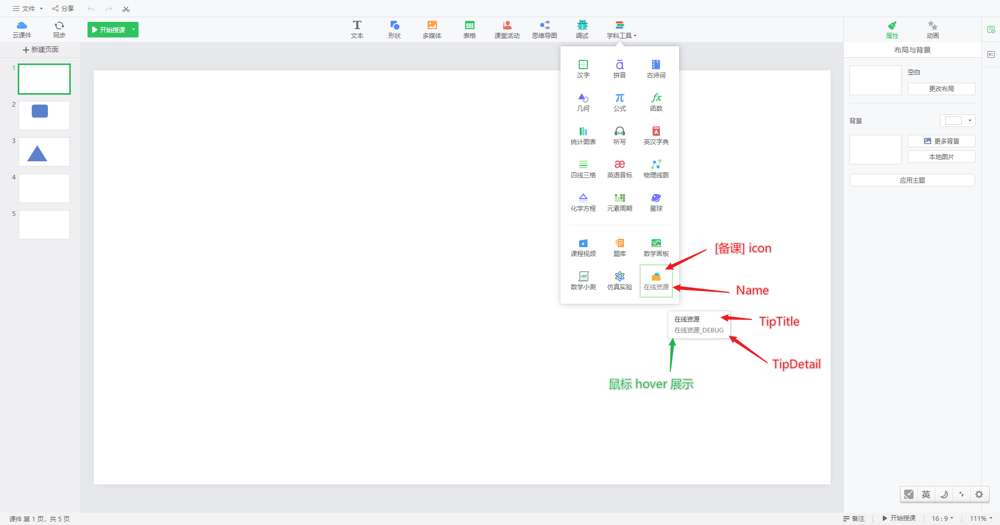
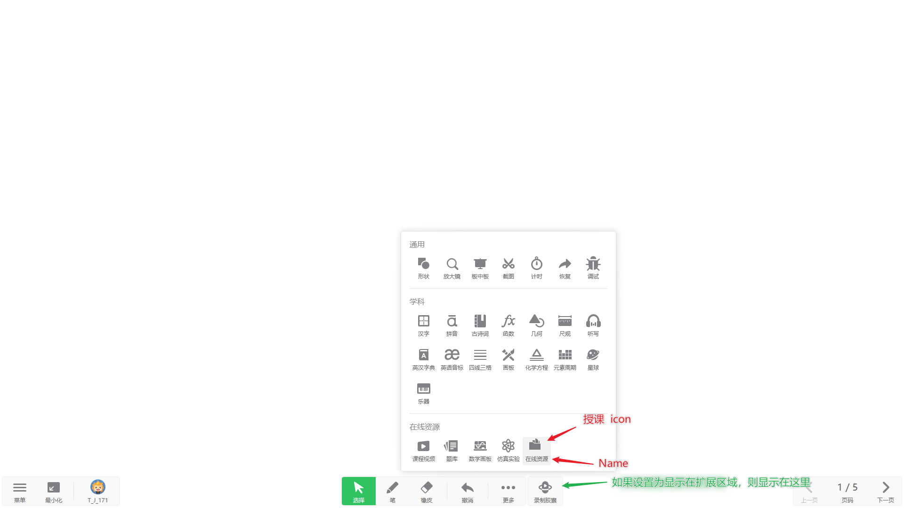

## 学科工具扩展

实现的功能：扩展学科工具，为用户提供更多的内容服务。

## 效果示意

## 详情

扩展的学科工具以插件的形式向用户提供，具体见 [学科工具扩展](../apis/extend-subject-tool/)。

用户点击工具之后，会打开一个窗口（WebView），呈现内容网页，网页可以使用 js 代码调用特定 API，向课件中插入内容。
具体可以插入哪些内容及其 API，见：[3 课件内容元素扩展](./03Content.md)
