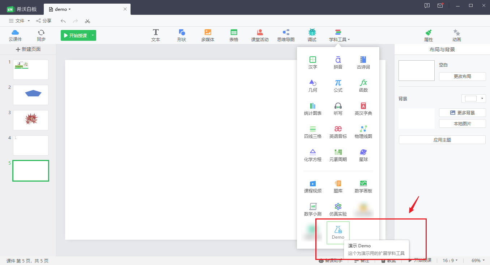

## 希沃白板开放平台文档

希沃白板 Windows 客户端现在可以提供的开放能力：

你（指第三方资源平台或开发者）可以使用这些开放能力将你的服务接入希沃白板 Windows 客户端。

1 [三方账号登录](./01Account.md)

用户可以直接使用三方账号进行登录（首次登录时需要绑定希沃账号）。

2 [学科工具扩展](./02ExtendTool.md)

可以为用户提供定制的学科工具，丰富课件内容和授课体验。

3 [课件内容元素扩展](./03Content.md)

学科工具扩展 和 课件内容元素扩展 通常配套一起使用，为课件提供更多的内容资源选择。

## 快速体验

Step1 下载安装 [希沃白板客户端](https://easinote.seewo.com/)  
Step2 下载安装 [demo 演示学科工具插件](https://github.com/EasiNote/EasiNote.ClientWebApi.Documentation/files/7249803/EasiNote.Plugin.WebTools.Demo.exe.zip)

> demo 演示学科工具插件，下载之后是一个 ZIP 包，需要先解压再运行。

重启启动 EN 客户端，打开任一课件，在备授课学科工具中，就可以找到新增的工具入口。

* 备课学科工具示意

* 授课学科工具示意

